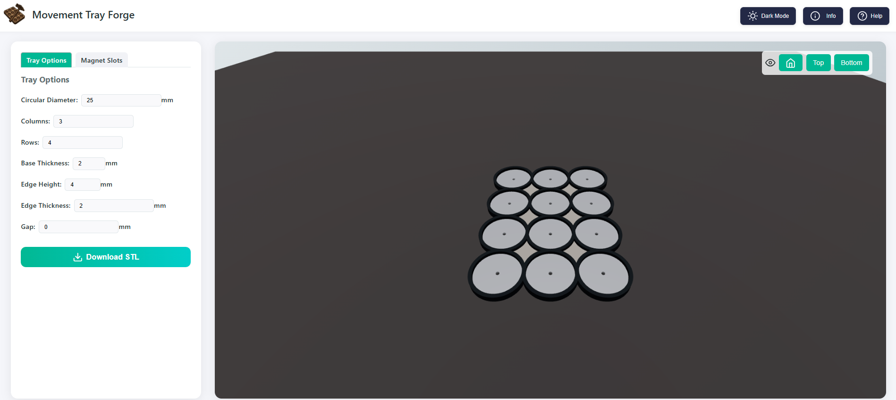

# Movement Forge

	

####  Movement Forge is a web app based tool to quickly create custom movement trays for miniature wargaming, exportable in STL format for FDM or Resin 3D printing, with support for a variety of custom sizes and configurations.

#### This project was bootstrapped with [Create React App](https://github.com/facebook/create-react-app).

## Demo Image

## Contents
- [Features](#features)
- [Run](#run)
- [Electron](#electron-build)
- [License](#license)
- [FAQ](#faq)

## Features
- Customisable base sizes and counts
- Customisable support slots including support for oval shaped bases
- Customisable magnet slots
- Different formations including Grid and Staggered
- Exports to STL format for easy 3D printing

## Run
1. Clone the repo
2. Install `npm` [using this guide](https://nodejs.org/en/learn/getting-started/an-introduction-to-the-npm-package-manager)
3. Run `npm i` to install dependencies
4. Run `npm start`
5. Open [http://localhost:3000](http://localhost:3000) to view it in your browser.

## Electron Build
1. Clone the repo
2. Install `npm` [using this guide](https://nodejs.org/en/learn/getting-started/an-introduction-to-the-npm-package-manager)
3. Run `npm i` to install dependencies
4. Run `npm build`
5. Run `npm run make` to package the application for win32
6. Run `movement-tray-gen.exe` in `out\movement-tray-gen-win32-x64\`

## License
[Add license type]

## FAQ
### Can I request a feature?
Sure! if theres a feature or special base style combination that you use in your tabletop games you can contact me and i'll do my best to implement popular requests

## AI Transparancy
The current logo for the application made use of generative AI (chatGPT)

