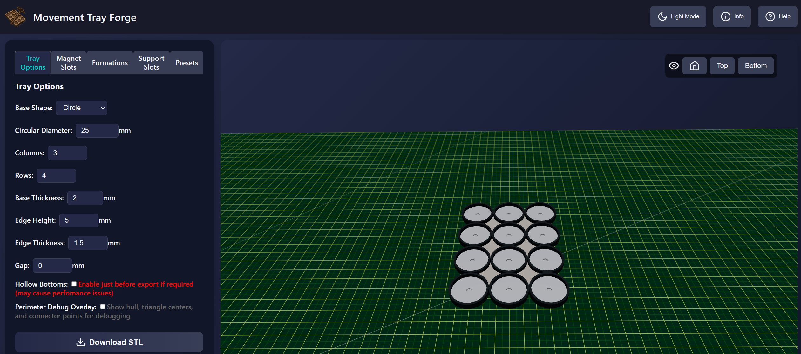

# Movement Forge

	

#### Movement Forge is a React application for quickly creating custom movement trays for miniature wargaming, exportable in STL format for FDM or resin 3D printing, with support for a variety of custom sizes and configurations.

The same Vite-powered renderer runs as a website and as an Electron desktop application.

## Demo Image

Screenshot taken of latest version

## Contents
- [Features](#features)
- [Run](#run)
- [Electron](#electron-build)
- [License](#license)
- [FAQ](#faq)

## Features
- Customisable base sizes and counts
- Customisable support slots including support for oval shaped bases
- Customisable magnet slots
- Different formations including Grid and Staggered
- Exports to STL format for easy 3D printing

## How to run

Use Node.js 24 LTS when developing locally. Node.js 20.19+ and 22.12+ are also supported.

### (Windows)EXE setup
1. [Download the Latest Release](https://github.com/tomkneller/movement-tray-gen/releases/latest)
2. Run the setup file
3. The application is installed and ready to use

### Web development
1. Clone the repo
2. Install `npm` [using this guide](https://nodejs.org/en/learn/getting-started/an-introduction-to-the-npm-package-manager)
3. Run `npm install` to install dependencies
4. Run `npm run dev`
5. Open [http://localhost:5173](http://localhost:5173) to view it in your browser.

### Electron development
1. Install dependencies with `npm install`
2. Run `npm start` to start Vite and open the Electron application

### Electron Build
1. Clone the repo
2. Install `npm` [using this guide](https://nodejs.org/en/learn/getting-started/an-introduction-to-the-npm-package-manager)
3. Run `npm install` to install dependencies
4. Run `npm run make` to build the renderer and create the platform installer/package
5. Find the generated artifacts in `out/make/`

### Web production build
1. Install dependencies with `npm install`
2. Run `npm run build`
3. Deploy the generated `dist/` directory to your static host

### Web Version
Visit [movement-tray-gen.vercel.app](https://movement-tray-gen.vercel.app/)

## FAQ
### Can I request a feature?
Sure! if theres a feature or special base style combination that you use in your tabletop games you can contact me and i'll do my best to implement popular requests

## AI Transparency
The current logo for the application made use of generative AI (chatGPT)

